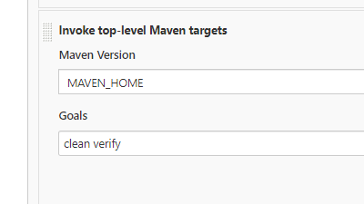
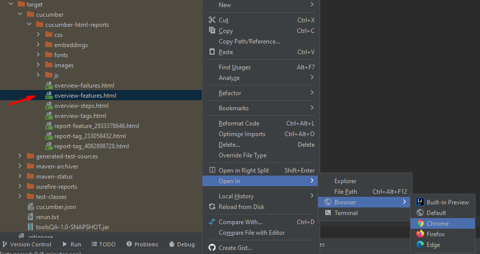
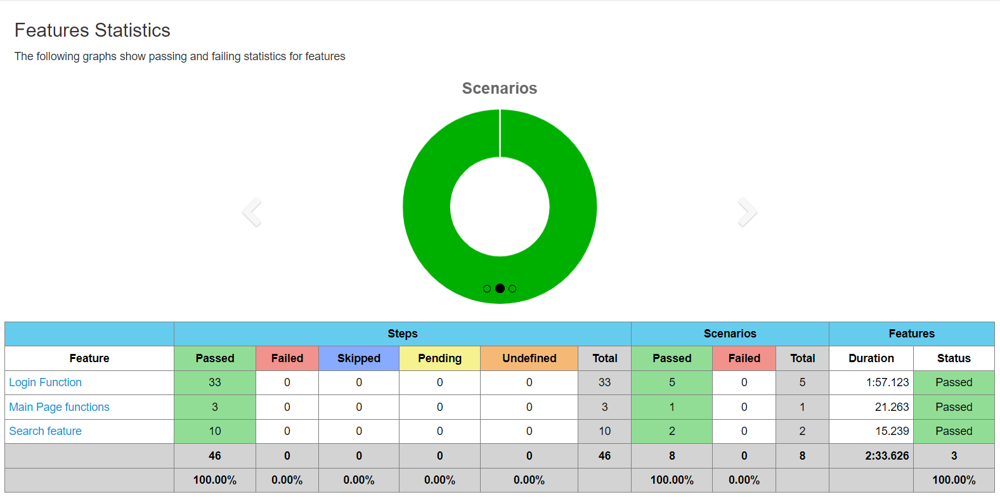

Tech Stack: Java, JUnit, Maven, Cucumber

**Important Note**
* You need to update credentials.properties file with the correct credentials

**How to run?**
* Open command prompt and go to application folder
* Write "mvn clean verify" and hit enter
* If you want to run specific feature, get the feature tag and set it into tags in TestRunner class

**How to run with Jenkins?**
* Create a job and set Maven targets as "clean verify"

**Report**
* After running the application, it generates the report under the "target" folder
* Go to the target folder and open overview-features.html in any browser

* The report seems in the browser like:

**Scenarios Approach**
* Main Page scenario is a fundamental case to make sure that the news is opening and there is no issue with that
* Search scenarios are basic cases for successful and no-result-found   ones
* Login scenarios are to check the successful login, unsuccessful login, and also forgot password cases
  To automate the login cases, we need to pass the robot block. The way I used is that:
- Navigate to the login page 
- Login to email with credentials (using built-in email client)
- Filter the emails by subject & save the login code email html
- Navigate the browser to this HTML
- Save login code
- Switch back to the parent tab & enter the login code
- Proceed with login